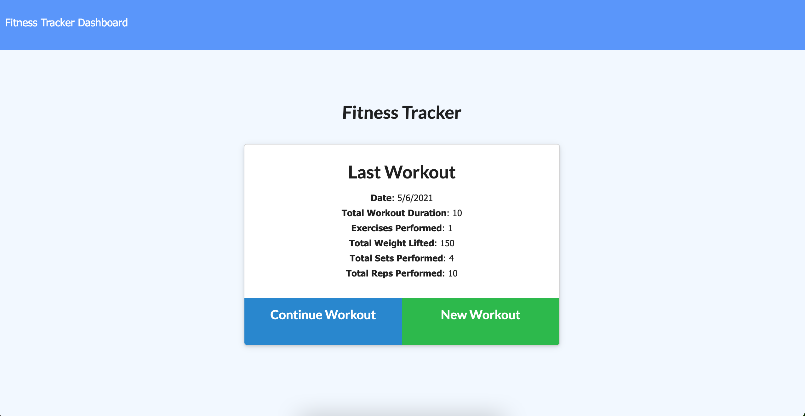
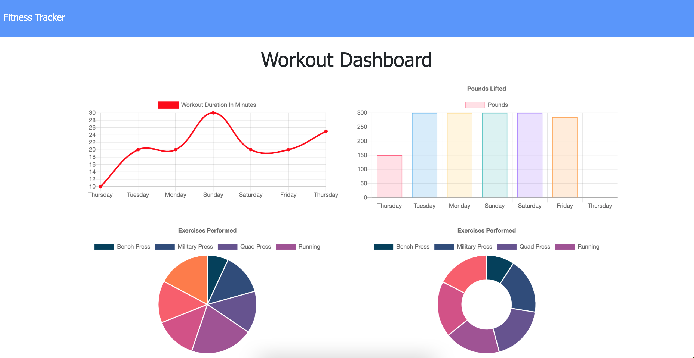
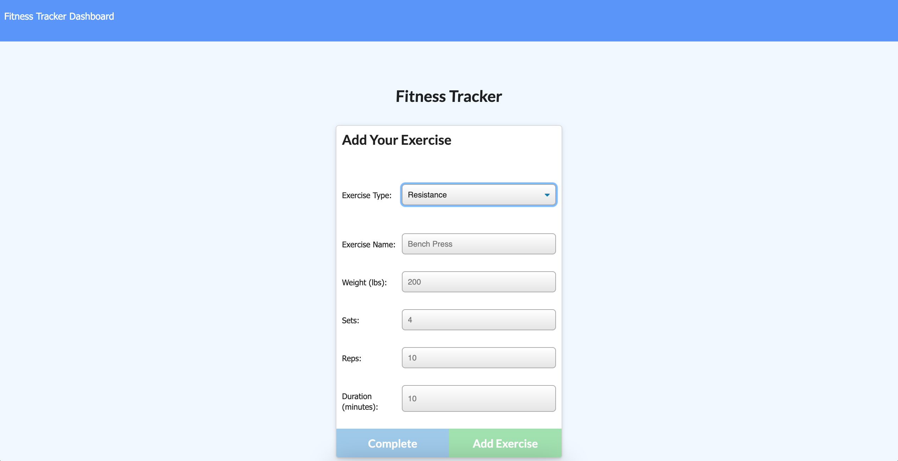

# Fitness Tracker READme

## Description
This application is designed to aid users in tracking data they are able to input to the tracker as well as view data and statistics for the workouts. Users are able to view, create, and track daily workouts with the ability to log multiple exercises in a workout on a given day. A workout is able to contain pertinent data such as the name of the exercises, types of exercises, weight, sets, reps, and duration of exercise. If the exercise is a cardio exercise, distance traveled may be logged as well.
## Table of Contents
- [Installation](#installation)
- [Usage](#usage)
- [Contribute](##contribute)
- [Test](##tests)
- [Contact](##questions?)

## Installation
If choosing to host locally, install the necessary dependencies by running the following command:

    npm i

## Usage
This web application is very user straightforward. The add and continue workout complete the functions they are labelled by, and users may view the results and statisitics of their workouts by clicking on the dashboard to see these stats.
### Demo

[Click here to view the deployed site.](https://hidden-falls-38045.herokuapp.com/)

---  

## Contribute
Please contact the email below for any contributions or issues.

## Tests
To test the app on a local instance, run the following command to provide the application with seed data:

    npm run seed

## Questions?
If you come across any issues with the repo, please open an issue, or contact me directly at: anth8nyc@gmail.com. More of my work is avaiable on GitHub at [anth8nyc](https://github.com/anth8nyc/).

